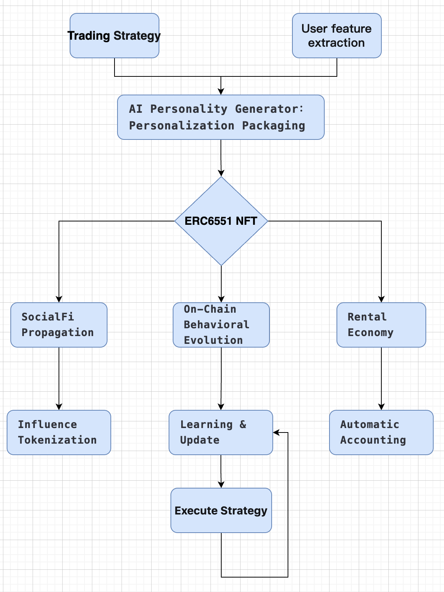

# Persona Finance AI (PFAI)
## The First DeFi Protocol Merging Personified Trading Strategies with **On-Chain Behavioral Evolution**
By creating self-evolving on-chain trading personas(ERC-6551 NFT), PFAI addresses three fundamental challenges:

1. **Strategy Rigidity** –  Conventional AI trading models lack dynamic market adaptability
2. **User Accessibility Barrier** – Complex DeFi strategies exceed mainstream users' technical capacity
3. **Value Capture** – High-performing strategies lack mechanisms for shared value distribution.

### Chainlink
We use VFT to change the properties, the file link:
https://github.com/bestWangc/Persona-Finance-AI/blob/main/smart_contracts/contracts/Personality.sol

In the future, we will use Chainlink's CCIP to implement more cross chain strategies

### Core Innovation Modules

PFAI achieves breakthrough innovation through three core modular architectures:
#### 1. Dynamic Persona Minting
- Transforms user risk profiles → Generates initial Persona NFTs

#### 2. Behavioral Evolution Engine
- On-chain transactions → Real-time strategy DNA upgrades
- Adaptive learning mechanism responds to market volatility/liquidity changes

#### 3. Social Finance Ecosystem
- **Persona Leasing**: Monetize idle strategy NFTs
- **Genetic Trait Trading**: Buy/sell high-performance strategy components
- **Influence Tokenization**: Governance rights + revenue sharing

